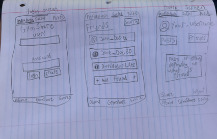
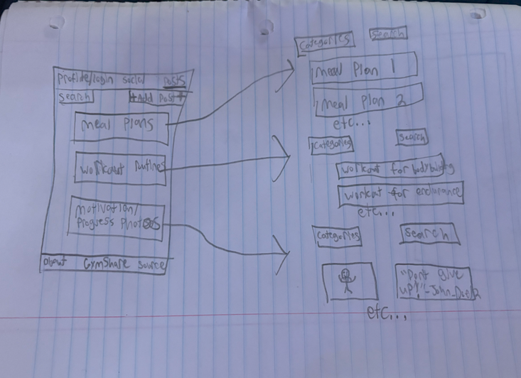

# startup-deliverable
### CS224 startup deliverable project
**Elevator Pitch -** My idea for an application would be called 'GymShare'. In this app, you
can share workouts, exercise routines, meal plans, or whatever else you
want to share with the whole community. The idea is to help those who are
serious about their fitness goals to reach them, getting inspiration from, using,
and building off of other people's plans that they post. It adds a great
community aspect to the gym, and can help anyone, from a high level bodybuilder,
to your every day gym-goer who wants to improve themselves one day at a time.

**Key Features -** This app would include different sections for workouts, meal plans,
progress and gym photos, and a chat section for those who want to discuss their gym goals. It would include
a system using hashtags, as well as separate sections like mentioned above so people
can find what they are looking for quick and easy.

**Description of each technology's use -**\
HTML: Creates separate sections for the different categories of workout routines, meal plans, etc.\
CSS: Choice of colored background, as well as good styling that works for phones, iPads, etc.\
JavaScript: Login, navigation to different sections of the application, typing into a chat box, etc.\
React: When a user presses a button, it will take them to the specified page based on what they pressed.\
Service: Backend service that helps to handle authenticating, database interactions, notifications, etc.\
Authentication: Will have a profile tab visible at all times.\
Database Data: Stores login data, posts from different profiles, credentials stored as well. Users cannot post without being logged into a profile.\
WebSocket: has an option to show recent posts at the front, also can show recent posts or most popular posts you post at your profile.\

Images:
\
\

**How React was implemented with this website -**
